<div align="center">

# MLX Swarm

**Turn one frontier-authored plan into a bounded DAG of local MLX workers — then
return one compact, auditable packet for final review.**

[](https://www.python.org/)
[](https://github.com/ml-explore/mlx)
[](https://github.com/fbzz/mlx-swarm/actions/workflows/ci.yml)
[](LICENSE)

</div>


MLX Swarm is a local execution layer for work that can be decomposed once and
verified mechanically. One frontier planning response creates a strict JSON
DAG, the operator previews and approves its digest, and local MLX workers run
the dependency graph in bounded batches. Deterministic gates reject malformed
artifacts and feed precise failures into limited repair loops. A completed run
becomes one self-contained `frontier-result.json` for one final judgment.

The framework does **not** call a frontier model between waves and never runs
worker-supplied commands. Schema-v2 workspace plans may execute only
operator-defined verification profiles, and only inside an isolated Git
worktree after the operator has approved the exact diff. It keeps
orchestration, mutation, validation, persistence, and review boundaries
explicit.

## Operating contract

| Phase | Frontier boundary | Local activity | Human control |
| --- | --- | --- | --- |
| Plan | One accepted, validated DAG artifact | Canonical validation and digest generation | Preview the whole DAG; approve the plan and execution digests |
| Execute | **No frontier coordination between waves** | MLX workers, deterministic gates, bounded repairs, and allowlisted verification | Apply or reject every mutating artifact by its displayed digest |
| Review | One accepted structured verdict for a completed run | Assemble the self-contained `frontier-result.json` | Decide whether a requested revision becomes a new linked plan |

Local worker usage and frontier planning/review usage are recorded separately.
“One accepted artifact” describes MLX Swarm's auditable phase boundary; it does
not claim visibility into provider-internal or Codex-internal model calls.

## Why this exists

Multi-agent demos often hide the expensive part in repeated coordinator calls
or treat every model response as trusted. MLX Swarm takes a narrower path:

- **Plan once.** The complete task DAG and its acceptance rules are explicit
  before local inference starts.
- **Batch compatible work.** Independent tasks in the same wave share a
  resident MLX model while preserving per-task sampling and token limits.
- **Gate artifacts locally.** Regex, JSON shape, enum, size, and Python syntax
  checks are deterministic and auditable.
- **Repair with a budget.** Rejected output receives exact gate feedback, never
  an open-ended retry loop.
- **Persist every transition.** Sessions survive interruption and retain the
  original validated plan.
- **Keep source changes isolated.** Typed diffs pause for digest-bound human
  approval, commit only to a retained session worktree, and never modify the
  original checkout.
- **Run only configured checks.** Plans reference profile IDs; workers cannot
  provide an executable command.
- **Review once at the boundary.** Only completed artifacts enter the compact
  final-review packet.
- **Count honestly.** Local generation and frontier receipts are stored
  separately; adapters that cannot report tokens remain explicitly
  `unavailable`.

## Quick start

### Requirements

- Apple silicon Mac
- Python 3.11+
- roughly 3 GB of free disk for the example 4-bit model

Clone and install:

```bash
git clone https://github.com/fbzz/mlx-swarm.git
cd mlx-swarm

python3 -m venv .venv
source .venv/bin/activate
python -m pip install --upgrade pip
python -m pip install -e ".[dev]"
```

Pre-download the example
[`mlx-community/Qwen3-4B-4bit`](https://huggingface.co/mlx-community/Qwen3-4B-4bit)
model. MLX Swarm intentionally performs cache-only model resolution at
runtime:

```bash
hf download mlx-community/Qwen3-4B-4bit
mlx-swarm --config examples/swarm.json doctor
```

Run the implementation → test/review example:

```bash
mlx-swarm --config examples/swarm.json run examples/plan.json --verbose
```

Or launch the local work cockpit:

```bash
mlx-swarm --config examples/swarm.json ui
```

The dashboard opens at `http://127.0.0.1:8765`. It exposes approved plans,
immutable run history, the live task DAG, gate evidence, normalized output,
batch metrics, typed diff approval, allowlisted verification evidence, resume,
lineage-preserving retry, and Frontier Commander.

Install the zero-extra-key Codex bridge:

```bash
mlx-swarm skill install
```

In the cockpit, enter an objective, create a commander request, and copy the
displayed `$mlx-swarm-commander` handoff into Codex. The skill imports one
validated plan for preview. **Approve and run** records the exact plan SHA-256
and, for workspace plans, the displayed execution SHA-256 before starting
local workers. When a completed run is ready, use the displayed review handoff
for the one final frontier verdict.

The skill uses existing Codex access and requires no separate provider key. The
Python process cannot observe Codex-internal token counts, so those receipts
are stored as unavailable rather than estimated.

## How it works

```mermaid
flowchart LR
    A["Frontier planning response"] --> B["Strict plan validation"]
    B --> C["Cockpit DAG preview"]
    C -->|"plan + execution digests"| D["Isolated Git worktree"]
    D --> E["Resident MLX backend"]
    E --> F["Deterministic gates"]
    F -->|"typed diff"| G["Human Apply or Reject"]
    G -->|"Apply"| H["Allowlisted verification"]
    F -->|"non-mutating"| I["Durable session"]
    H -->|"pass"| I
    F -->|"reject + budget remains"| R["Bounded repair prompt"]
    R --> E
    I --> J["frontier-result.json v3"]
    J --> K["One final frontier review"]
    K --> L["Persisted verdict"]
```



For each topological wave, the executor:

1. blocks descendants of rejected, failed, or blocked dependencies;
2. chunks runnable tasks by `maxWorkers`;
3. groups compatible temperature, top-p, and seed settings;
4. generates with one resident MLX model;
5. normalizes and gates every artifact;
6. retries only rejected tasks with remaining repair budget;
7. for schema-v2 mutating artifacts, pauses on a validated diff until the
   operator applies or rejects its digest;
8. runs only the referenced, snapshotted verification profiles;
9. atomically persists task, artifact, decision, verification, and batch state.

Completed dependency output is injected into downstream prompts as explicitly
untrusted candidate material. Rejected output never propagates.

## Plan contract

Plans are strict JSON: unknown fields, duplicate task IDs, bad dependencies,
cycles, invalid regexes, unsupported roles, and incorrectly typed settings fail
before model loading.

```json
{
  "schemaVersion": 1,
  "planId": "implement-test-review",
  "objective": "Build and review a small Python module",
  "tasks": [
    {
      "id": "implement",
      "role": "implementation",
      "prompt": "Return complete Python source only.",
      "gate": {
        "requiredPatterns": [
          {"id": "has-def", "pattern": "def result\\("}
        ],
        "forbiddenPatterns": [],
        "format": "text",
        "pythonSyntax": true,
        "maxCharacters": 5000
      },
      "maxRepairAttempts": 2
    },
    {
      "id": "review",
      "role": "review",
      "prompt": "Return a JSON verdict.",
      "dependsOn": ["implement"],
      "gate": {
        "requiredPatterns": [],
        "forbiddenPatterns": [],
        "format": "json",
        "jsonRequiredKeys": ["verdict"],
        "jsonAllowedKeys": ["verdict"],
        "jsonFieldEnums": {"verdict": ["approve", "reject"]}
      }
    }
  ]
}
```

See [`examples/plan.json`](examples/plan.json) for a complete example and
[`lat.md/plans.md`](lat.md/plans.md) for the field reference.

## Workspace execution boundary

Schema-v1 configs and plans remain generation-only. Schema v2 is opt-in and
adds operator authority for paths and fixed verification commands:

```json
{
  "schemaVersion": 2,
  "model": {"repository": "mlx-community/Qwen3-4B-4bit"},
  "batch": {"maxWorkers": 4},
  "artifacts": ".swarm/runs",
  "workspace": {
    "writeRoots": ["src", "tests"],
    "verificationProfiles": {
      "pytest": {
        "argv": ["python", "-m", "pytest", "-q"],
        "cwd": ".",
        "timeoutSeconds": 300,
        "inheritEnv": ["PATH", "LANG"],
        "environment": {"PYTHONDONTWRITEBYTECODE": "1"}
      }
    }
  }
}
```

A workspace task declares a typed artifact, path ceiling, and profile IDs—not
a command:

```json
{
  "id": "implement",
  "role": "implementation",
  "prompt": "Return exactly one unified Git diff.",
  "artifactType": "patch",
  "allowedPaths": ["src/package"],
  "verification": ["pytest"]
}
```

`patch` and `test-suite` payloads must be text-only unified Git diffs. `review`
is structured JSON, while `report` is non-mutating text or Markdown. At most one
mutating artifact may appear in a DAG level.

Before launch, MLX Swarm auto-detects the nearest Git top-level and displays two
digests. The plan digest binds the canonical plan. The execution digest binds
that plan, the resolved workspace root, base HEAD, write roots, and referenced
verification profiles:

```bash
mlx-swarm --config examples/swarm.json workspace preview \
  examples/workspace-plan.json
```

Approval creates `mlx-swarm/<plan-id>/<session-id>` and a worktree below
`<artifacts>/_worktrees/`. Dirty staged, unstaged, and untracked source changes
are reported but excluded because the worktree starts from the displayed
committed HEAD.

A mutating worker result passes through this lifecycle:

1. validate paths, metadata, file modes, symlinks, and a fixed
   `git apply --check`;
2. persist the immutable artifact and pause at `awaiting_approval`;
3. show the full escaped diff and require its SHA-256 for Apply or Reject;
4. on Apply, recheck HEAD and cleanliness, stage the diff, and create one
   hook-free, unsigned commit on the session branch;
5. run only snapshotted profile argument arrays with no shell, closed stdin,
   bounded logs, timeouts, and a sanitized environment;
6. unblock descendants only after every referenced profile passes.

A failed check leaves the applied commit visible. The operator can rerun the
same profiles or reject the artifact, which creates an explicit revert commit.
Cleanup removes only a terminal run's worktree; its branch remains. MLX Swarm
has no merge, cherry-pick, or promotion action.

See [`examples/workspace-plan.json`](examples/workspace-plan.json) and
[`lat.md/workspace-execution.md`](lat.md/workspace-execution.md).

## Deterministic gates

Each task can combine:

| Gate | What it checks |
| --- | --- |
| `requiredPatterns` | Every named multiline regex must match |
| `forbiddenPatterns` | No named multiline regex may match |
| `maxCharacters` | Normalized artifact stays within a hard size limit |
| `format: "json"` | Output parses as exactly one JSON value |
| `pythonSyntax` | Python output compiles without executing |
| `jsonRequiredKeys` | Required top-level keys are present |
| `jsonAllowedKeys` | Unexpected top-level keys are rejected |
| `jsonFieldEnums` | Selected scalar fields use allowed values |
| `stripSingleCodeFence` | One authorized outer code fence is removed |

Completed thinking blocks, trailing model role tokens, common preambles, and an
authorized single code fence can be normalized before validation. Every
normalization and violation is recorded.

## CLI

```text
mlx-swarm --config CONFIG doctor
mlx-swarm --config CONFIG run PLAN [--approve-plan-digest SHA256] [--approve-execution-digest SHA256]
mlx-swarm --config CONFIG inspect SESSION_DIR [--task ID] [--output]
mlx-swarm --config CONFIG resume SESSION_DIR [--max-repair N] [--verbose]
mlx-swarm --config CONFIG list
mlx-swarm --config CONFIG artifact show SESSION_DIR TASK_ID
mlx-swarm --config CONFIG artifact apply SESSION_DIR TASK_ID --digest SHA256
mlx-swarm --config CONFIG artifact reject SESSION_DIR TASK_ID --digest SHA256
mlx-swarm --config CONFIG artifact verify SESSION_DIR TASK_ID --digest SHA256
mlx-swarm --config CONFIG workspace preview PLAN
mlx-swarm --config CONFIG workspace status SESSION_DIR
mlx-swarm --config CONFIG workspace cleanup SESSION_DIR
mlx-swarm --config CONFIG ui [--plans-dir DIR] [--host 127.0.0.1] [--port 8765]
mlx-swarm --config CONFIG commander create --objective TEXT [--constraint TEXT]
mlx-swarm --config CONFIG commander show REQUEST_ID
mlx-swarm --config CONFIG commander claim-plan REQUEST_ID
mlx-swarm --config CONFIG commander import-plan REQUEST_ID RESPONSE --claim-id ID
mlx-swarm --config CONFIG commander claim-review SESSION_DIR
mlx-swarm --config CONFIG commander import-review SESSION_DIR RESPONSE --claim-id ID
mlx-swarm skill install [--skills-dir DIR] [--force]
```

| Command | Purpose |
| --- | --- |
| `doctor` | Validate config and confirm the model exists locally without loading Metal |
| `run` | Execute a validated plan and write a durable session |
| `inspect` | Read session or task evidence from disk |
| `resume` | Continue interrupted pending work without re-running completed tasks |
| `list` | List sessions below the configured artifact directory |
| `artifact` | Show a typed artifact or submit a digest-bound human decision |
| `workspace` | Preview execution authority, inspect lineage, or remove a terminal worktree |
| `ui` | Launch the localhost-only operator cockpit |
| `commander` | Create, inspect, claim, and import frontier planning/review handoffs |
| `skill install` | Install the bundled `mlx-swarm-commander` Codex skill |

`swarm` remains a deprecated CLI alias for the 0.2 release. The former
`swarm_agents` Python namespace also forwards to `mlx_swarm` temporarily.

## Run artifacts

```text
.swarm/runs/<plan-id>/<session-id>/
├── session.json          # complete task, gate, repair, and batch state
├── plan.snapshot.json    # immutable validated plan used by this run
├── frontier-plan-receipt.json
├── frontier-usage.json   # separate planning/review usage, never mixed with local
├── runner.log            # subprocess diagnostics for UI-launched runs
├── workspace.snapshot.json # immutable paths, base SHA, profiles, branch/worktree
├── artifacts/<task-id>/
│   ├── manifest.json     # immutable type, digest, base, affected/allowed paths
│   ├── payload.diff      # or payload.json / payload.md
│   ├── decision.json     # immutable initial Apply or Reject receipt
│   └── verification/    # bounded logs and attempt receipts
├── frontier-result.json  # v2 generation packet or v3 workspace packet
├── frontier-review.json  # optional persisted final verdict
└── frontier-review-receipt.json
```

Commander request evidence lives under:

```text
.swarm/runs/_commander/requests/<request-id>/
├── request.json
├── plan-prompt.txt
├── frontier-plan.raw.txt
├── plan.validated.json
└── frontier-plan-receipt.json
```

True resume preserves the same session and completed artifacts. Retrying a
partial or failed run creates a new immutable session with a `retryOf` pointer
to its parent.

## Architecture

The runtime is intentionally small and dependency-light outside MLX:

| Module | Responsibility |
| --- | --- |
| `contracts.py` | Strict config and plan parsing, limits, and DAG validation |
| `commander.py` | Frontier requests, prompts, claims, approvals, review contracts, and usage receipts |
| `backend.py` | Cache-only model resolution and grouped MLX batch generation |
| `executor.py` | Topological execution, chunking, blocking, and repair loops |
| `gates.py` | Output normalization and deterministic validation |
| `prompting.py` | Authority, context, dependency, task, and repair prompts |
| `session.py` | Atomic persistence and final packet export |
| `workspace.py` | Git discovery, execution digests, worktrees, artifacts, decisions, verification, and cleanup |
| `skill_install.py` | Safe installation of the bundled Codex orchestration skill |
| `ui.py` | Localhost HTTP boundary and isolated CLI subprocess launch |
| `ui_static/` | Packaged dependency-free operator cockpit |
| `cli.py` | Runtime, commander, cockpit, and skill-install commands |

The [`lat.md/`](lat.md/) knowledge base records the architecture, contracts,
trade-offs, and test specifications next to `@lat:` source anchors.

## Testing

The test suite never loads a model. Backends and subprocesses are replaced with
bounded fakes so contracts, orchestration, persistence, HTTP boundaries, and
failure behavior remain fast and reproducible:

```bash
python -m pytest -q
```

Current release baseline: **132 passed** when localhost sockets are available.
In a socket-restricted sandbox, the same suite reports **126 passed, 6 skipped**;
the skipped cases are the live HTTP-server checks.

The screenshot above is a real completed local run on an Apple M4 Pro: three
workers across two DAG waves, one model load, three generation calls, 1,848
local tokens, and a persisted final-review packet. It is an example, not a
cross-machine benchmark.

## Scope and limitations

- Apple silicon and MLX only.
- Local workers are text generators and never supply commands. Workspace mode
  can run trusted operator-defined verification profiles against an approved
  diff inside the isolated worktree.
- Local deterministic gates cannot prove semantic correctness.
- A human must approve every frontier-authored plan and execution digest, then
  separately approve or reject every mutating artifact digest.
- Session branches are never promoted into the original checkout automatically.
- The Codex skill exposes one accepted artifact per phase, but MLX Swarm cannot
  inspect Codex-internal call counts or token usage.
- Runtime model downloads are disabled by design.
- Session files may contain sensitive prompt and output data; protect the
  artifact directory accordingly.

## License

[MIT](LICENSE)
