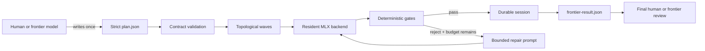

<div align="center">

# Swarm Agents

**Turn one frontier-authored plan into a bounded DAG of local MLX workers — then
return one compact, auditable packet for final review.**

[](https://www.python.org/)
[](https://github.com/ml-explore/mlx)
[](#testing)
[](LICENSE)

</div>


Swarm Agents is a local execution layer for work that can be decomposed once
and verified mechanically. A stronger model or a human writes a strict JSON
plan. Local MLX workers execute its dependency graph in bounded batches.
Deterministic gates reject malformed artifacts and feed precise failures into
limited repair loops. The finished run becomes a single `frontier-result.json`
for final judgment.

The framework does **not** call a frontier model between waves and does **not**
execute generated code. It keeps orchestration, validation, persistence, and
review boundaries explicit.

## Why this exists

Multi-agent demos often hide the expensive part in repeated coordinator calls
or treat every model response as trusted. Swarm Agents takes a narrower path:

- **Plan once.** The complete task DAG and its acceptance rules are explicit
  before local inference starts.
- **Batch compatible work.** Independent tasks in the same wave share a
  resident MLX model while preserving per-task sampling and token limits.
- **Gate artifacts locally.** Regex, JSON shape, enum, size, and Python syntax
  checks are deterministic and auditable.
- **Repair with a budget.** Rejected output receives exact gate feedback, never
  an open-ended retry loop.
- **Persist every transition.** Sessions survive interruption and retain the
  original validated plan.
- **Review once at the boundary.** Only completed artifacts enter the compact
  final-review packet.

## Quick start

### Requirements

- Apple silicon Mac
- Python 3.11+
- roughly 3 GB of free disk for the example 4-bit model

Clone and install:

```bash
git clone https://github.com/fbzz/swarm-agents.git
cd swarm-agents

python3 -m venv .venv
source .venv/bin/activate
python -m pip install --upgrade pip
python -m pip install -e ".[dev]"
```

Pre-download the example
[`mlx-community/Qwen3-4B-4bit`](https://huggingface.co/mlx-community/Qwen3-4B-4bit)
model. Swarm Agents intentionally performs cache-only model resolution at
runtime:

```bash
hf download mlx-community/Qwen3-4B-4bit
swarm --config examples/swarm.json doctor
```

Run the implementation → test/review example:

```bash
swarm --config examples/swarm.json run examples/plan.json --verbose
```

Or launch the local work cockpit:

```bash
swarm --config examples/swarm.json ui
```

The dashboard opens at `http://127.0.0.1:8765`. It exposes approved plans,
immutable run history, the live task DAG, gate evidence, normalized output,
batch metrics, resume, and lineage-preserving retry.

## How it works



For each topological wave, the executor:

1. blocks descendants of rejected, failed, or blocked dependencies;
2. chunks runnable tasks by `maxWorkers`;
3. groups compatible temperature, top-p, and seed settings;
4. generates with one resident MLX model;
5. normalizes and gates every artifact;
6. retries only rejected tasks with remaining repair budget;
7. atomically persists task and batch state.

Completed dependency output is injected into downstream prompts as explicitly
untrusted candidate material. Rejected output never propagates.

## Plan contract

Plans are strict JSON: unknown fields, duplicate task IDs, bad dependencies,
cycles, invalid regexes, unsupported roles, and incorrectly typed settings fail
before model loading.

```json
{
  "schemaVersion": 1,
  "planId": "implement-test-review",
  "objective": "Build and review a small Python module",
  "tasks": [
    {
      "id": "implement",
      "role": "implementation",
      "prompt": "Return complete Python source only.",
      "gate": {
        "requiredPatterns": [
          {"id": "has-def", "pattern": "def result\\("}
        ],
        "forbiddenPatterns": [],
        "format": "text",
        "pythonSyntax": true,
        "maxCharacters": 5000
      },
      "maxRepairAttempts": 2
    },
    {
      "id": "review",
      "role": "review",
      "prompt": "Return a JSON verdict.",
      "dependsOn": ["implement"],
      "gate": {
        "requiredPatterns": [],
        "forbiddenPatterns": [],
        "format": "json",
        "jsonRequiredKeys": ["verdict"],
        "jsonAllowedKeys": ["verdict"],
        "jsonFieldEnums": {"verdict": ["approve", "reject"]}
      }
    }
  ]
}
```

See [`examples/plan.json`](examples/plan.json) for a complete example and
[`lat.md/plans.md`](lat.md/plans.md) for the field reference.

## Deterministic gates

Each task can combine:

| Gate | What it checks |
| --- | --- |
| `requiredPatterns` | Every named multiline regex must match |
| `forbiddenPatterns` | No named multiline regex may match |
| `maxCharacters` | Normalized artifact stays within a hard size limit |
| `format: "json"` | Output parses as exactly one JSON value |
| `pythonSyntax` | Python output compiles without executing |
| `jsonRequiredKeys` | Required top-level keys are present |
| `jsonAllowedKeys` | Unexpected top-level keys are rejected |
| `jsonFieldEnums` | Selected scalar fields use allowed values |
| `stripSingleCodeFence` | One authorized outer code fence is removed |

Completed thinking blocks, trailing model role tokens, common preambles, and an
authorized single code fence can be normalized before validation. Every
normalization and violation is recorded.

## CLI

```text
swarm --config CONFIG doctor
swarm --config CONFIG run PLAN [--session-dir DIR] [--max-repair N] [--verbose]
swarm --config CONFIG inspect SESSION_DIR [--task ID] [--output]
swarm --config CONFIG resume SESSION_DIR [--max-repair N] [--verbose]
swarm --config CONFIG list
swarm --config CONFIG ui [--plans-dir DIR] [--host 127.0.0.1] [--port 8765]
```

| Command | Purpose |
| --- | --- |
| `doctor` | Validate config and confirm the model exists locally without loading Metal |
| `run` | Execute a validated plan and write a durable session |
| `inspect` | Read session or task evidence from disk |
| `resume` | Continue interrupted pending work without re-running completed tasks |
| `list` | List sessions below the configured artifact directory |
| `ui` | Launch the localhost-only operator cockpit |

## Run artifacts

```text
.swarm/runs/<plan-id>/<session-id>/
├── session.json          # complete task, gate, repair, and batch state
├── plan.snapshot.json    # immutable validated plan used by this run
├── runner.log            # subprocess diagnostics for UI-launched runs
└── frontier-result.json  # compact completed-artifact handoff
```

True resume preserves the same session and completed artifacts. Retrying a
partial or failed run creates a new immutable session with a `retryOf` pointer
to its parent.

## Architecture

The runtime is intentionally small and dependency-light outside MLX:

| Module | Responsibility |
| --- | --- |
| `contracts.py` | Strict config and plan parsing, limits, and DAG validation |
| `backend.py` | Cache-only model resolution and grouped MLX batch generation |
| `executor.py` | Topological execution, chunking, blocking, and repair loops |
| `gates.py` | Output normalization and deterministic validation |
| `prompting.py` | Authority, context, dependency, task, and repair prompts |
| `session.py` | Atomic persistence and final packet export |
| `ui.py` | Localhost HTTP boundary and isolated CLI subprocess launch |
| `ui_static/` | Packaged dependency-free operator cockpit |
| `cli.py` | `doctor`, `run`, `inspect`, `resume`, `list`, and `ui` |

The [`lat.md/`](lat.md/) knowledge base records the architecture, contracts,
trade-offs, and test specifications next to `@lat:` source anchors.

## Testing

The test suite never loads a model. Backends and subprocesses are replaced with
bounded fakes so contracts, orchestration, persistence, HTTP boundaries, and
failure behavior remain fast and reproducible:

```bash
python -m pytest -q
```

Current release baseline: **85 passed, 4 skipped**. The skipped cases are the
optional live HTTP-server checks when local socket binding is unavailable.

The screenshot above is a real completed local run on an Apple M4 Pro: three
workers across two DAG waves, one model load, three generation calls, 1,848
local tokens, and a persisted final-review packet. It is an example, not a
cross-machine benchmark.

## Scope and limitations

- Apple silicon and MLX only.
- Text generation only; no tool execution or generated-code execution.
- Local deterministic gates cannot prove semantic correctness.
- A human or stronger model must author the plan and perform final review.
- Runtime model downloads are disabled by design.
- Session files may contain sensitive prompt and output data; protect the
  artifact directory accordingly.

## License

[MIT](LICENSE)
