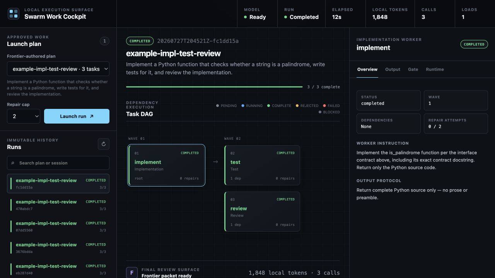

<div align="center">

# MLX Swarm

**Make a small 4B LLM do the heavy lifting — locally.**

Plan once with frontier intelligence. Run the repeated implementation, test,
and review work on your Mac. Return one compact result for final judgment.

[](https://www.python.org/)
[](https://github.com/ml-explore/mlx)
[](https://huggingface.co/mlx-community/Qwen3-4B-4bit)
[](https://github.com/fbzz/mlx-swarm/actions/workflows/ci.yml)
[](LICENSE)

</div>

MLX Swarm is a local-first coding-agent runtime for Apple silicon. It turns one
high-quality plan into a bounded DAG of small, specialized jobs and runs them
with one resident MLX model. The local 4B model powers the agent swarm through
the token-heavy middle: writing artifacts, producing tests, checking
dependencies, reviewing outputs, and repairing deterministic failures. A
frontier model, when used, is reserved for the two decisions where it has the
most leverage: planning the work and judging the final packet.

| Plan once | Do the work locally | Review once |
| --- | --- | --- |
| A frontier model defines the DAG, constraints, and acceptance rules | A cached 4B MLX model powers bounded agents on your Mac | One compact `frontier-result.json` carries the evidence for final judgment |

**Local inference is the engine, not a fallback.** During execution there is no
frontier coordinator between waves. Agent prompts, dependency outputs, repair
loops, and generated artifacts stay on the machine. The MLX backend resolves
models cache-only, keeps the model loaded across the run, and batches compatible
jobs. Use the included
[`mlx-community/Qwen3-4B-4bit`](https://huggingface.co/mlx-community/Qwen3-4B-4bit)
configuration or point MLX Swarm at another compatible cached MLX model.



## How MLX Swarm makes a 4B model useful

A small model should not have to behave like an entire autonomous engineering
team in one prompt. MLX Swarm gives it a tighter job:

- **Decompose before inference.** The complete DAG, authoritative context,
  dependencies, output protocol, and acceptance rules exist before the local
  model starts.
- **Specialize every call.** Each agent produces one bounded artifact such as
  a patch, test suite, JSON review, or Markdown report.
- **Share one resident model.** Independent jobs are batched by compatible
  sampling settings instead of repeatedly loading the model.
- **Reject bad shape deterministically.** Regex, JSON, enum, size, and Python
  syntax gates catch malformed output without spending a frontier call.
- **Repair with exact feedback.** A failed agent sees the specific gate
  violations and gets only the plan's limited retry budget.
- **Escalate a result, not a transcript.** The final reviewer receives a compact
  evidence packet instead of coordinating every local step.

That division of labor is the product thesis: spend local tokens on execution
and scarce frontier attention on decisions.

## Operating contract

| Phase | Frontier boundary | Local activity | Human control |
| --- | --- | --- | --- |
| Plan | One accepted, validated DAG artifact | Canonical validation and digest generation | Preview the whole DAG; approve the plan and execution digests |
| Execute | **No frontier coordination between waves** | MLX agents, deterministic gates, bounded repairs, and allowlisted verification | Apply or reject every mutating artifact by its displayed digest |
| Review | One accepted structured verdict for a completed run | Assemble the self-contained `frontier-result.json` | Decide whether a requested revision becomes a new linked plan |

Local agent usage and frontier planning/review usage are recorded separately.
“One accepted artifact” describes MLX Swarm's auditable phase boundary; it does
not claim visibility into provider-internal or Codex-internal model calls.

## Built for controlled local work

Multi-agent demos often hide the expensive part in repeated coordinator calls
or treat every model response as trusted. MLX Swarm keeps the execution
boundary explicit:

- **Plan once.** The complete task DAG and its acceptance rules are explicit
  before local inference starts.
- **Batch compatible work.** Independent tasks in the same wave share a
  resident MLX model while preserving per-task sampling and token limits.
- **Gate artifacts locally.** Regex, JSON shape, enum, size, and Python syntax
  checks are deterministic and auditable.
- **Repair with a budget.** Rejected output receives exact gate feedback, never
  an open-ended retry loop.
- **Persist every transition.** Sessions survive interruption and retain the
  original validated plan.
- **Keep source changes isolated.** Typed diffs pause for digest-bound human
  approval, commit only to a retained session worktree, and never modify the
  original checkout.
- **Run only configured checks.** Plans reference profile IDs; agents cannot
  provide an executable command.
- **Review once at the boundary.** Only completed artifacts enter the compact
  final-review packet.
- **Count honestly.** Local generation and frontier receipts are stored
  separately; adapters that cannot report tokens remain explicitly
  `unavailable`.

The framework never runs agent-supplied commands. Schema-v2 workspace plans
may execute only operator-defined verification profiles, and only inside an
isolated Git worktree after the operator approves the exact diff.

## Quick start

### Requirements

- Apple silicon Mac
- Python 3.11+
- roughly 3 GB of free disk for the example 4-bit model

Clone and install:

```bash
git clone https://github.com/fbzz/mlx-swarm.git
cd mlx-swarm

python3 -m venv .venv
source .venv/bin/activate
python -m pip install --upgrade pip
python -m pip install -e ".[dev]"
```

Pre-download the example
[`mlx-community/Qwen3-4B-4bit`](https://huggingface.co/mlx-community/Qwen3-4B-4bit)
model. MLX Swarm intentionally performs cache-only model resolution at
runtime:

```bash
hf download mlx-community/Qwen3-4B-4bit
mlx-swarm --config examples/swarm.json doctor
```

Run the implementation → test/review example:

```bash
mlx-swarm --config examples/swarm.json run examples/plan.json --verbose
```

Or launch the local work cockpit:

```bash
mlx-swarm --config examples/swarm.json ui
```

The dashboard opens at `http://127.0.0.1:8765`. It exposes approved plans,
immutable run history, the live task DAG, gate evidence, normalized output,
batch metrics, typed diff approval, allowlisted verification evidence, resume,
lineage-preserving retry, and Frontier Commander.

Install the zero-extra-key Codex bridge:

```bash
mlx-swarm skill install
```

The skill uses existing Codex access and requires no separate provider key. The
Python process cannot observe Codex-internal token counts, so those receipts
are stored as unavailable rather than estimated.

## How to use

### Recommended: cockpit and Codex

1. **Check readiness.**

   ```bash
   mlx-swarm --config examples/swarm.json doctor
   ```

   `doctor` validates the config, resolves the cached model, and reports the
   detected Git workspace boundary without loading the model into memory.

2. **Install the skill once and start the cockpit.**

   ```bash
   mlx-swarm skill install
   mlx-swarm --config examples/swarm.json ui
   ```

3. **Request a plan.** In **Frontier Commander**, enter the objective and any
   constraints, create the request, and copy the displayed **Plan with Codex**
   handoff into Codex. The skill returns one strict Plan JSON artifact to MLX
   Swarm; it does not start local execution.

4. **Inspect before approving.** Review the complete DAG, task prompts,
   dependencies, gates, artifact types, allowed paths, verification profiles,
   detected Git root, base commit, plan digest, and execution digest. Choose
   **Approve and run** only if that displayed authority is correct.

5. **Supervise local execution.** Local MLX agents execute the DAG without
   frontier coordination between waves. Non-mutating reports and reviews can
   complete automatically. Every `patch` or `test-suite` artifact pauses with
   its full escaped diff and SHA-256.

6. **Apply or reject each diff.** **Apply** rechecks the digest and worktree,
   commits the diff only to the isolated session branch, and automatically runs
   the referenced allowlisted verification profiles. **Reject** seals the
   artifact and blocks its descendants. A failed check remains visible for an
   explicit verification rerun or revert.

7. **Review the completed run.** A successful workspace run produces
   `frontier-result.json` v3 with outputs, gates, commits, diffs, verification
   receipts, lineage, and local usage. Copy **Review with Codex** for the one
   final structured verdict. Requested changes begin a new linked commander
   request; the completed run is never rewritten.

The browser and executor never contact a frontier provider directly. The
operator controls both Codex handoffs and every workspace mutation.

### Measure frontier-token economics

For the current product stage, start with the preliminary decision gate:
two calibration cases followed by six measured cases, one per project and
balanced across two small, two medium, and two large reference patches. This
is 16 arm executions. Only move to the full six-calibration / 30-measured
profile after local-agent acceptance is competitive.

The frontier is adapter-neutral. The legacy `bugsinpy-v1` profile pins
GPT-5.6 Sol through Codex; `bugsinpy-glm52` pins GLM 5.2 through a stateless
single-completion Hermes bridge. Both use the configured local MLX model with
at most
two repairs, a 45-minute ceiling per arm, seed `20260728`, a 20 GiB storage
ceiling, and a 15 GiB free-space reserve.

Fair-protocol evaluations additionally freeze one shared task packet and one
shared set of production write roots for both arms. The packet contains the
objective, failing evidence, acceptance argv, repository tree, and exact
relevant test/traceback source. Frontier plans may not narrow the local arm’s
path authority, and every workspace excerpt given to a local agent must match
one contiguous region of the buggy checkout. Git may safely recount incorrect
hunk line metadata, but it never changes the proposed additions or removals.
Every local prompt and raw response is retained in an immutable attempt record.
The exact shared authority and packet digest are retained as
`pair-contract.json` beside the frozen case.

Every profile pins its frontier command version and canonical digest. For the
Codex profile, install the exact official CLI in the ignored benchmark tooling
directory and put it first on `PATH`:

```bash
npm install --prefix .swarm/tooling/codex-0.145.0 \
  @openai/codex@0.145.0
export PATH="$PWD/.swarm/tooling/codex-0.145.0/node_modules/.bin:$PATH"
codex --version  # codex-cli 0.145.0
```

For the GLM 5.2 study, configure Hermes with provider `ollama-cloud`, then
verify the frozen identity:

```bash
hermes status
hermes --version
# Hermes Agent v0.19.0 (2026.7.20) · upstream cbc1054e
```

The harness uses the pinned Hermes installation to resolve the provider
endpoint and credentials, then bypasses its interactive agent loop. The
packaged bridge makes exactly one OpenAI-compatible request per frontier phase
with no tools, JSON-object response mode, no SDK retry, and a pinned 16,384
completion-token ceiling. Prompts are passed by file rather than process
arguments. The direct arm returns `edit-manifest-v1`; the swarm arm returns one
validated plan and, only after eligible local completion, one structured
review. Missing, incomplete, mismatched-provider/model, multi-call, or
arithmetically inconsistent usage receipts invalidate the measurement rather
than becoming zero. Preparation and execution fail closed if the command
version or profile digest differs from the frozen environment.

Prepare the preliminary immutable suite, pass its two-case calibration gate,
then run the six measured pairs:

```bash
mlx-swarm --config examples/swarm.json eval prepare \
  benchmarks/bugsinpy-v1/profile.json --preliminary

mlx-swarm --config examples/swarm.json eval run EVALUATION_ID \
  --phase pilot --profile benchmarks/bugsinpy-v1/profile.json --preliminary

mlx-swarm --config LOCAL_MODEL_CONFIG eval replay-local EVALUATION_ID \
  --worker-mode reasoning-edit --reasoning-max-tokens 1200

mlx-swarm --config examples/swarm.json eval run EVALUATION_ID \
  --phase measured --profile benchmarks/bugsinpy-v1/profile.json --preliminary
```

Run the equivalent preliminary GLM 5.2 comparison by changing only the pinned
profile:

```bash
mlx-swarm --config LOCAL_MODEL_CONFIG eval prepare \
  benchmarks/bugsinpy-glm52/profile.json --preliminary

mlx-swarm --config LOCAL_MODEL_CONFIG eval run EVALUATION_ID \
  --phase pilot --profile benchmarks/bugsinpy-glm52/profile.json --preliminary

mlx-swarm --config LOCAL_MODEL_CONFIG eval replay-local EVALUATION_ID \
  --worker-mode reasoning-edit --reasoning-max-tokens 1200

mlx-swarm --config LOCAL_MODEL_CONFIG eval run EVALUATION_ID \
  --phase measured --profile benchmarks/bugsinpy-glm52/profile.json --preliminary
```

`eval replay-local` performs no frontier planning or review. It copies each
calibration task's exact saved initial prompt into a fresh isolated worktree,
checks the saved prompt digest, reuses the accepted plan, and evaluates the
new local candidate with the independent oracle. The measured phase unlocks
only when every frozen calibration case scores `1`. A failed or invalid replay
keeps it locked, so a weak 4B worker cannot trigger six new frontier pairs.

To test a newly constrained delegation strategy without changing that frozen
gate, supply capability-adapted plans:

```bash
mlx-swarm --config LOCAL_MODEL_CONFIG eval replay-local EVALUATION_ID \
  --worker-mode direct --adapted-plan-dir .swarm/capability-test-plans
```

This mode still records `frontierCalls: 0`, but marks the evidence
`diagnosticOnly: true` and always leaves `measuredEligible: false`. Passing it
shows that the local model can execute the adapted task shape; a new frozen
evaluation is still required before measured work can unlock.

The default `direct` worker makes one local generation per attempt. For small
models that identify a repair but struggle to emit an exact artifact, enable a
fully local reasoning-to-editing pipeline:

```json
{
  "worker": {
    "mode": "reasoning-edit",
    "reasoningMaxTokens": 1200,
    "capabilities": {
      "parameterScale": "4B",
      "contextWindowTokens": 262144,
      "maxGenerationTokens": 1200,
      "specialization": "general",
      "delegationLevel": "exact-edit",
      "strengths": ["Renders bounded exact replacements."],
      "limitations": ["Unreliable independent diagnosis."],
      "calibration": {
        "status": "failed",
        "passedCases": 0,
        "totalCases": 2,
        "evidenceSha256": "lowercase-sha256-of-replay-evidence"
      }
    }
  }
}
```

The deterministic Frontier Commander prompt always includes this worker
capability contract. It separates model scale from worker concurrency and
states the context window, prompt-character ceiling, generation ceiling,
specialization, execution mode, calibration, and safe delegation level. With
`exact-edit`, the frontier must retain diagnosis and design responsibility and
delegate only mechanical transformations with exact files, symbols, source
anchors, and old-to-new instructions. Plans cannot request more generation
tokens than `maxGenerationTokens`.

Commander plans also carry a mandatory candidate-change specificity record.
The frontier must simulate its proposed edit through the observed failing path
and at least one named passing or non-target control path, then explain why its
predicate is the narrowest evidence-backed discriminator. For exact-edit
workers, that candidate must match the literal old-to-new task instructions.
This catches the important case where a small worker faithfully renders a
mechanical edit but the frontier selected an overly broad behavioral proxy.
Standalone historical plans remain readable, but a new commander response
without this evidence is rejected before approval or local inference.

Only mutating `patch` and `test-suite` tasks use two stages. The first pass
reasons over the frozen artifact prompt; the second receives that reasoning as
untrusted JSON-string-encoded evidence and must emit only the strict artifact.
Both stages count toward `localUsage`; neither is a frontier call. The replay
ledger records `frontierCalls: 0`, the model fingerprint, worker strategy,
saved-plan digest, saved-prompt digest, oracle result, time, and local tokens.

If preparation is interrupted before `evaluation.json` seals the suite, resume
the same evaluation and reuse its completed case runtimes:

```bash
mlx-swarm --config examples/swarm.json eval prepare \
  benchmarks/bugsinpy-v1/profile.json --preliminary \
  --resume EVALUATION_ID
```

Execution is one case at a time, pass@1, and resumable. The measured phase
remains locked until the calibration pairs prove preparation, isolation,
frontier usage capture, storage enforcement, immutable result serialization, and
the separate zero-frontier local replay gate.
Preparation also requires a clean MLX Swarm source checkout so the recorded
commit identifies the exact harness. The metadata checkout, upstream project
mirrors, and fixed-validation tree are removed before either model arm starts.
Every selected case is oracle-preflighted during preparation; a case that does
not prove buggy-fails/fixed-passes is recorded, excluded, and deterministically
replaced before the suite is frozen.
Historical compiled projects use a bounded four-job ccache during unscored
preparation; fixed-revision objects are not admitted to that shared cache.
Inspect progress or export sanitized evidence and the generated tables:

```bash
mlx-swarm --config examples/swarm.json eval status EVALUATION_ID

mlx-swarm --config examples/swarm.json eval report EVALUATION_ID \
  --export benchmarks/results/EVALUATION_ID \
  --readme README.md

mlx-swarm --config examples/swarm.json eval report EVALUATION_ID \
  --export benchmarks/results/EVALUATION_ID \
  --readme README.md --check
```

An interrupted full-study ledger that already contains the balanced first six
measured pairs can be published without more inference:

```bash
mlx-swarm --config examples/swarm.json eval report EVALUATION_ID \
  --preliminary --readme README.md

mlx-swarm --config examples/swarm.json eval report EVALUATION_ID \
  --preliminary --readme README.md --check
```

`--preliminary` deterministically selects two valid calibration pairs and the
first valid six-project 2/2/2 measured subset. It never selects by score and
can never enable the 30-pair product claim.

Raw evidence remains under `.swarm/evaluations/<evaluationId>/`; the public
export omits prompts, raw model responses, fixed patches, and local absolute
paths. A missing `turn.completed` usage event invalidates that measurement
instead of becoming zero. Frontier and local tokens are never combined.
The active Docker endpoint is resolved from the operator's Docker context and
frozen into each sanitized verification profile because verifier processes use
an isolated `HOME`. Docker/context/container failures are classified as
`invalid` measurements; ordinary candidate test, import, and assertion
failures remain executable score `0`.

### Use an existing plan

Place a validated plan below the cockpit's approved plans directory, select it
from the left rail, inspect its complete preview, and launch it. Schema-v1 plans
are generation-only. Schema-v2 plans additionally require the displayed
execution digest and use typed workspace artifacts.

The included examples demonstrate both modes:

- [`examples/plan.json`](examples/plan.json): generation-only
  implementation → test/review DAG.
- [`examples/workspace-plan.json`](examples/workspace-plan.json): typed
  workspace patch → test-suite → review DAG.

### CLI-only workspace flow

First preview and record the two displayed digests:

```bash
mlx-swarm --config examples/swarm.json workspace preview \
  examples/workspace-plan.json
```

Launch using those exact values. Supplying a known session directory makes the
approval commands easy to run from another terminal:

```bash
mlx-swarm --config examples/swarm.json run \
  examples/workspace-plan.json \
  --session-dir .swarm/runs/manual-workspace-run \
  --approve-plan-digest PLAN_SHA256 \
  --approve-execution-digest EXECUTION_SHA256 \
  --verbose
```

When the executor pauses, inspect the artifact and submit its displayed digest:

```bash
mlx-swarm --config examples/swarm.json artifact show \
  .swarm/runs/manual-workspace-run TASK_ID

mlx-swarm --config examples/swarm.json artifact apply \
  .swarm/runs/manual-workspace-run TASK_ID --digest ARTIFACT_SHA256
```

`artifact apply` automatically runs the snapshotted verification profiles.
After a failed check, `artifact verify` reruns those same profiles; it never
accepts a command:

```bash
mlx-swarm --config examples/swarm.json artifact verify \
  .swarm/runs/manual-workspace-run TASK_ID --digest ARTIFACT_SHA256

mlx-swarm --config examples/swarm.json artifact reject \
  .swarm/runs/manual-workspace-run TASK_ID --digest ARTIFACT_SHA256
```

Inspect retained lineage or remove only a terminal run's worktree:

```bash
mlx-swarm --config examples/swarm.json workspace status \
  .swarm/runs/manual-workspace-run

mlx-swarm --config examples/swarm.json workspace cleanup \
  .swarm/runs/manual-workspace-run
```

Cleanup retains the session branch. Promotion into the original checkout is an
explicit manual Git operation outside MLX Swarm.

## How it works

```mermaid
flowchart LR
    A["Frontier planning response"] --> B["Strict plan validation"]
    B --> C["Cockpit DAG preview"]
    C -->|"plan + execution digests"| D["Isolated Git worktree"]
    D --> E["Resident MLX backend"]
    E --> F["Deterministic gates"]
    F -->|"typed diff"| G["Human Apply or Reject"]
    G -->|"Apply"| H["Allowlisted verification"]
    F -->|"non-mutating"| I["Durable session"]
    H -->|"pass"| I
    F -->|"reject + budget remains"| R["Bounded repair prompt"]
    R --> E
    I --> J["frontier-result.json v3"]
    J --> K["One final frontier review"]
    K --> L["Persisted verdict"]
```



For each topological wave, the executor:

1. blocks descendants of rejected, failed, or blocked dependencies;
2. chunks runnable tasks by `maxWorkers`;
3. groups compatible temperature, top-p, and seed settings;
4. generates with one resident MLX model;
5. normalizes and gates every artifact;
6. retries only rejected tasks with remaining repair budget;
7. for schema-v2 mutating artifacts, pauses on a validated diff until the
   operator applies or rejects its digest;
8. runs only the referenced, snapshotted verification profiles;
9. atomically persists task, artifact, decision, verification, and batch state.

Completed dependency output is injected into downstream prompts as explicitly
untrusted candidate material. Rejected output never propagates.

## Plan contract

Plans are strict JSON: unknown fields, duplicate task IDs, bad dependencies,
cycles, invalid regexes, unsupported roles, and incorrectly typed settings fail
before model loading.

```json
{
  "schemaVersion": 1,
  "planId": "implement-test-review",
  "objective": "Build and review a small Python module",
  "tasks": [
    {
      "id": "implement",
      "role": "implementation",
      "prompt": "Return complete Python source only.",
      "gate": {
        "requiredPatterns": [
          {"id": "has-def", "pattern": "def result\\("}
        ],
        "forbiddenPatterns": [],
        "format": "text",
        "pythonSyntax": true,
        "maxCharacters": 5000
      },
      "maxRepairAttempts": 2
    },
    {
      "id": "review",
      "role": "review",
      "prompt": "Return a JSON verdict.",
      "dependsOn": ["implement"],
      "gate": {
        "requiredPatterns": [],
        "forbiddenPatterns": [],
        "format": "json",
        "jsonRequiredKeys": ["verdict"],
        "jsonAllowedKeys": ["verdict"],
        "jsonFieldEnums": {"verdict": ["approve", "reject"]}
      }
    }
  ]
}
```

See [`examples/plan.json`](examples/plan.json) for a complete example and
[`lat.md/plans.md`](lat.md/plans.md) for the field reference.

## Workspace execution boundary

Schema-v1 configs and plans remain generation-only. Schema v2 is opt-in and
adds operator authority for paths and fixed verification commands:

```json
{
  "schemaVersion": 2,
  "model": {"repository": "mlx-community/Qwen3-4B-4bit"},
  "batch": {"maxWorkers": 4},
  "artifacts": ".swarm/runs",
  "worker": {
    "mode": "reasoning-edit",
    "reasoningMaxTokens": 1200,
    "capabilities": {
      "parameterScale": "4B",
      "contextWindowTokens": 262144,
      "maxGenerationTokens": 1200,
      "specialization": "code",
      "delegationLevel": "bounded-implementation"
    }
  },
  "workspace": {
    "writeRoots": ["src", "tests"],
    "verificationProfiles": {
      "pytest": {
        "argv": ["python", "-m", "pytest", "-q"],
        "cwd": ".",
        "timeoutSeconds": 300,
        "inheritEnv": ["PATH", "LANG"],
        "environment": {"PYTHONDONTWRITEBYTECODE": "1"}
      }
    }
  }
}
```

A workspace task declares a typed artifact, path ceiling, and profile IDs—not
a command:

```json
{
  "id": "implement",
  "role": "implementation",
  "prompt": "Return the smallest exact search/replace edits.",
  "artifactType": "patch",
  "workerOutputProtocol": "edit-manifest-v1",
  "allowedPaths": ["src/package"],
  "verification": ["pytest"],
  "gate": {
    "requiredPatterns": [],
    "forbiddenPatterns": [],
    "maxCharacters": 4000,
    "format": "json",
    "jsonRequiredKeys": ["edits"],
    "jsonAllowedKeys": ["edits"]
  }
}
```

`patch` and `test-suite` payloads must be text-only unified Git diffs. `review`
is structured JSON, while `report` is non-mutating text or Markdown. At most one
mutating artifact may appear in a DAG level. Small workers can use
`edit-manifest-v1` to return strict exact-anchor JSON; MLX Swarm materializes
and validates the unified diff before the operator sees or approves it. The
persisted artifact is still a diff, never an automatically applied edit.

Before launch, MLX Swarm auto-detects the nearest Git top-level and displays two
digests. The plan digest binds the canonical plan. The execution digest binds
that plan, the resolved workspace root, base HEAD, write roots, and referenced
verification profiles:

```bash
mlx-swarm --config examples/swarm.json workspace preview \
  examples/workspace-plan.json
```

Approval creates `mlx-swarm/<plan-id>/<session-id>` and a worktree below
`<artifacts>/_worktrees/`. Dirty staged, unstaged, and untracked source changes
are reported but excluded because the worktree starts from the displayed
committed HEAD.

A mutating agent result passes through this lifecycle:

1. validate paths, metadata, file modes, symlinks, and a fixed
   `git apply --check`;
2. persist the immutable artifact and pause at `awaiting_approval`;
3. show the full escaped diff and require its SHA-256 for Apply or Reject;
4. on Apply, recheck HEAD and cleanliness, stage the diff, and create one
   hook-free, unsigned commit on the session branch;
5. run only snapshotted profile argument arrays with no shell, closed stdin,
   bounded logs, timeouts, and a sanitized environment;
6. unblock descendants only after every referenced profile passes.

A failed check leaves the applied commit visible. The operator can rerun the
same profiles or reject the artifact, which creates an explicit revert commit.
Cleanup removes only a terminal run's worktree; its branch remains. MLX Swarm
has no merge, cherry-pick, or promotion action.

See [`examples/workspace-plan.json`](examples/workspace-plan.json) and
[`lat.md/workspace-execution.md`](lat.md/workspace-execution.md).

## Deterministic gates

Each task can combine:

| Gate | What it checks |
| --- | --- |
| `requiredPatterns` | Every named multiline regex must match |
| `forbiddenPatterns` | No named multiline regex may match |
| `maxCharacters` | Normalized artifact stays within a hard size limit |
| `format: "json"` | Output parses as exactly one JSON value |
| `pythonSyntax` | Python output compiles without executing |
| `jsonRequiredKeys` | Required top-level keys are present |
| `jsonAllowedKeys` | Unexpected top-level keys are rejected |
| `jsonFieldEnums` | Selected scalar fields use allowed values |
| `stripSingleCodeFence` | One authorized outer code fence is removed |

Completed thinking blocks, trailing model role tokens, common preambles, and an
authorized single code fence can be normalized before validation. Every
normalization and violation is recorded.

## CLI

```text
mlx-swarm --config CONFIG doctor
mlx-swarm --config CONFIG run PLAN [--approve-plan-digest SHA256] [--approve-execution-digest SHA256]
mlx-swarm --config CONFIG inspect SESSION_DIR [--task ID] [--output]
mlx-swarm --config CONFIG resume SESSION_DIR [--max-repair N] [--verbose]
mlx-swarm --config CONFIG list
mlx-swarm --config CONFIG artifact show SESSION_DIR TASK_ID
mlx-swarm --config CONFIG artifact apply SESSION_DIR TASK_ID --digest SHA256
mlx-swarm --config CONFIG artifact reject SESSION_DIR TASK_ID --digest SHA256
mlx-swarm --config CONFIG artifact verify SESSION_DIR TASK_ID --digest SHA256
mlx-swarm --config CONFIG workspace preview PLAN
mlx-swarm --config CONFIG workspace status SESSION_DIR
mlx-swarm --config CONFIG workspace cleanup SESSION_DIR
mlx-swarm --config CONFIG ui [--plans-dir DIR] [--host 127.0.0.1] [--port 8765]
mlx-swarm --config CONFIG commander create --objective TEXT [--constraint TEXT]
mlx-swarm --config CONFIG commander show REQUEST_ID
mlx-swarm --config CONFIG commander claim-plan REQUEST_ID
mlx-swarm --config CONFIG commander import-plan REQUEST_ID RESPONSE --claim-id ID
mlx-swarm --config CONFIG commander claim-review SESSION_DIR
mlx-swarm --config CONFIG commander import-review SESSION_DIR RESPONSE --claim-id ID
mlx-swarm --config CONFIG eval replay-local EVALUATION_ID \
  [--worker-mode direct|reasoning-edit] [--reasoning-max-tokens N] \
  [--adapted-plan-dir DIR]
mlx-swarm skill install [--skills-dir DIR] [--force]
```

| Command | Purpose |
| --- | --- |
| `doctor` | Validate config and confirm the model exists locally without loading Metal |
| `run` | Execute a validated plan and write a durable session |
| `inspect` | Read session or task evidence from disk |
| `resume` | Continue interrupted pending work without re-running completed tasks |
| `list` | List sessions below the configured artifact directory |
| `artifact` | Show a typed artifact or submit a digest-bound human decision |
| `workspace` | Preview execution authority, inspect lineage, or remove a terminal worktree |
| `ui` | Launch the localhost-only operator cockpit |
| `commander` | Create, inspect, claim, and import frontier planning/review handoffs |
| `eval replay-local` | Reuse frozen calibration plans/prompts with zero frontier calls, or run explicitly diagnostic capability-adapted plans |
| `skill install` | Install the bundled `mlx-swarm-commander` Codex skill |

`swarm` remains a deprecated CLI alias for the 0.2 release. The former
`swarm_agents` Python namespace also forwards to `mlx_swarm` temporarily.

## Run artifacts

```text
.swarm/runs/<plan-id>/<session-id>/
├── session.json          # complete task, gate, repair, and batch state
├── plan.snapshot.json    # immutable validated plan used by this run
├── frontier-plan-receipt.json
├── frontier-usage.json   # separate planning/review usage, never mixed with local
├── runner.log            # subprocess diagnostics for UI-launched runs
├── workspace.snapshot.json # immutable paths, base SHA, profiles, branch/worktree
├── artifacts/<task-id>/
│   ├── manifest.json     # immutable type, digest, base, affected/allowed paths
│   ├── payload.diff      # or payload.json / payload.md
│   ├── decision.json     # immutable initial Apply or Reject receipt
│   └── verification/    # bounded logs and attempt receipts
├── frontier-result.json  # v2 generation packet or v3 workspace packet
├── frontier-review.json  # optional persisted final verdict
└── frontier-review-receipt.json
```

Commander request evidence lives under:

```text
.swarm/runs/_commander/requests/<request-id>/
├── request.json
├── plan-prompt.txt
├── frontier-plan.raw.txt
├── plan.validated.json
└── frontier-plan-receipt.json
```

True resume preserves the same session and completed artifacts. Retrying a
partial or failed run creates a new immutable session with a `retryOf` pointer
to its parent.

## Architecture

The runtime is intentionally small and dependency-light outside MLX:

| Module | Responsibility |
| --- | --- |
| `contracts.py` | Strict config and plan parsing, limits, and DAG validation |
| `commander.py` | Frontier requests, prompts, claims, approvals, review contracts, and usage receipts |
| `backend.py` | Cache-only model resolution and grouped MLX batch generation |
| `executor.py` | Topological execution, chunking, blocking, and repair loops |
| `gates.py` | Output normalization and deterministic validation |
| `prompting.py` | Authority, context, dependency, task, and repair prompts |
| `session.py` | Atomic persistence and final packet export |
| `workspace.py` | Git discovery, execution digests, worktrees, artifacts, decisions, verification, and cleanup |
| `evaluation.py` | Frozen BugsInPy suites, isolated paired execution, usage capture, oracle scoring, economics, and publication |
| `skill_install.py` | Safe installation of the bundled Codex orchestration skill |
| `ui.py` | Localhost HTTP boundary and isolated CLI subprocess launch |
| `ui_static/` | Packaged dependency-free operator cockpit |
| `cli.py` | Runtime, commander, cockpit, and skill-install commands |

The [`lat.md/`](lat.md/) knowledge base records the architecture, contracts,
trade-offs, and test specifications next to `@lat:` source anchors.

## Testing

The test suite never loads a model. Backends and subprocesses are replaced with
bounded fakes so contracts, orchestration, persistence, HTTP boundaries, and
failure behavior remain fast and reproducible:

```bash
python -m pytest -q
```

Current release baseline is maintained by the test suite; live socket tests may
skip in restricted sandboxes.

The screenshot above is a real completed local run on an Apple M4 Pro: three
agents across two DAG waves, one model load, three generation calls, 1,848
local tokens, and a persisted final-review packet. It is an example, not a
cross-machine benchmark.

<!-- BEGIN MLX-SWARM-ECONOMICS -->
## Preliminary measured economics

**Study status:** `protocol_invalid` — The recorded rows are diagnostic history, not a fair paired economics comparison. A new evaluation must be prepared and run under the current protocol.

**Protocol audit:** `invalid` — The tables below are retained to diagnose the old run, but they are not a valid paired comparison.

**Preliminary 6-pair study.** This is a directional decision gate, not the planned 30-pair claim study. The strong “saves frontier tokens without reducing acceptance” claim is disabled regardless of the observed deltas.

**Decision gate:** `rerun_fair_protocol` — Do not use this study to judge worker acceptance or token economics; rerun the preliminary suite under the current symmetric protocol.

Pinned protocol: `BugsInPy@11c5f1eea954a42132cfd06bf257766a7963e0fd` · `gpt-5.6-sol` (high) · local `local/qwen35-4b-opus-uncensored-6bit@e017ecf449428c52171387b7dee317e4803708940b8f50ea1c1ef0d25529cd3d` · seed `20260728`.

Recorded `2026-07-28T16:55:42.669391+00:00` on `arm64` / `arm` with 48.0 GiB memory. MLX Swarm commit `2f741c0f4f195272c65feef12939db1096c36717`; Codex `codex-cli 0.145.0`.

One-time case preparation (excluded from task timing): 04:14 across 8 cases.

Scores are binary executable-oracle results. Times are end-to-end wall time and exclude one-time benchmark preparation. Frontier and local tokens are intentionally separate. This pass@1 study is one suite on one machine; it does not establish monetary savings or generalize beyond the pinned protocol.

| Metric | Frontier Alone | MLX Swarm | Delta |
|---|---:|---:|---:|
| Completed | 6/6 (100.0%) | 0/6 (0.0%) | -6 |
| Score | 6/6 | 0/6 | -6 |
| Median end-to-end time | 03:09 | 02:39 | -15.9% |
| Frontier tokens (total / median) | 2,017,393 / 406,294 | 886,183 / 138,726 | 1,131,210 fewer (56.1%) |
| Local tokens (total / median) | — | 70,304 / 8,730 | separate |
| Repairs (total / median) | — | 12 / 2 | — |
| Model loads | — | 6 | — |

| Task | Project | Frontier score | Frontier time | Frontier tokens | Swarm score | Swarm time | Swarm frontier tokens | Local tokens | Repairs | Loads | Review | Token delta | Time delta |
|---|---|---:|---:|---:|---:|---:|---:|---:|---:|---:|---|---:|---:|
| [black-7](benchmarks/results/bugsinpy-v1-20260728t162359z-preliminary-6/cases/black-7.json) | black | 1 | 04:19 | 485,254 | 0 | 08:31 | 264,546 | 25,362 | 2 | 1 | not eligible | 220,708 | -04:11 |
| [fastapi-14](benchmarks/results/bugsinpy-v1-20260728t162359z-preliminary-6/cases/fastapi-14.json) | fastapi | 1 | 03:11 | 429,543 | 0 | 04:19 | 192,032 | 14,645 | 2 | 1 | not eligible | 237,511 | -01:09 |
| [luigi-20](benchmarks/results/bugsinpy-v1-20260728t162359z-preliminary-6/cases/luigi-20.json) | luigi | 1 | 03:07 | 430,410 | 0 | 03:01 | 125,267 | 10,390 | 2 | 1 | not eligible | 305,143 | +00:05 |
| [scrapy-19](benchmarks/results/bugsinpy-v1-20260728t162359z-preliminary-6/cases/scrapy-19.json) | scrapy | 1 | 01:18 | 138,274 | 0 | 01:32 | 55,705 | 6,026 | 2 | 1 | not eligible | 82,569 | -00:14 |
| [sanic-5](benchmarks/results/bugsinpy-v1-20260728t162359z-preliminary-6/cases/sanic-5.json) | sanic | 1 | 01:24 | 150,867 | 0 | 02:02 | 96,447 | 7,070 | 2 | 1 | not eligible | 54,420 | -00:39 |
| [tornado-8](benchmarks/results/bugsinpy-v1-20260728t162359z-preliminary-6/cases/tornado-8.json) | tornado | 1 | 07:26 | 383,045 | 0 | 02:16 | 152,186 | 6,811 | 2 | 1 | not eligible | 230,859 | +05:10 |

Study: `bugsinpy-v1-20260728t162359z-preliminary-6` · paired cases: 6/6 · 95% bootstrap token-saving interval: 117,341.3 to 256,145.8 tokens. Accepted-by-both savings: — tokens across 0 cases.
<!-- END MLX-SWARM-ECONOMICS -->

## Scope and limitations

- Apple silicon and MLX only.
- Local agents are text generators and never supply commands. Workspace mode
  can run trusted operator-defined verification profiles against an approved
  diff inside the isolated worktree.
- Local deterministic gates cannot prove semantic correctness.
- A human must approve every frontier-authored plan and execution digest, then
  separately approve or reject every mutating artifact digest.
- Session branches are never promoted into the original checkout automatically.
- The Codex skill exposes one accepted artifact per phase, but MLX Swarm cannot
  inspect Codex-internal call counts or token usage.
- Runtime model downloads are disabled by design.
- Session files may contain sensitive prompt and output data; protect the
  artifact directory accordingly.

## License

[MIT](LICENSE)
