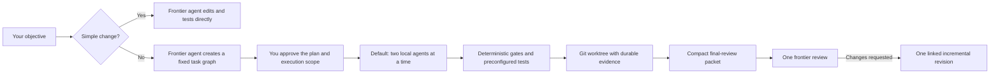

<div align="center">

# MLX Swarm

**Your frontier agent plans. Small local agents do the heavy lifting. Your
frontier agent reviews.**

Run controlled coding-agent workflows on Apple silicon with one resident MLX
model. The shipped profile defaults to two local agents working at the same
time.

[](https://github.com/fbzz/mlx-swarm/releases/latest)
[](https://github.com/fbzz/mlx-swarm/actions/workflows/ci.yml)
[](https://www.python.org/)
[](https://github.com/ml-explore/mlx)
[](#current-scope)
[](LICENSE)

[Quick start](#quick-start) · [How it works](#how-it-works) ·
[Safety](#safe-by-construction) · [Evidence](#measured-evidence)

</div>

MLX Swarm is a local-first coding-agent runtime for Mac. A strong frontier
coding agent—Claude Code, Codex, or another compatible Agent Skills host—turns
an objective into exact, dependency-aware tasks. A small local model implements
those tasks, writes tests, checks outputs, and produces reports. The frontier
agent returns only for one final review.

The Python runtime does not call a remote model between local-agent waves.
Prompts, intermediate outputs, retries, and generated artifacts remain on your
machine during execution.

| Plan once | Execute locally | Review once |
| --- | --- | --- |
| Your frontier agent defines the files, interfaces, dependencies, and acceptance rules | The default profile runs up to two local agents at a time on one resident MoE MLX model | Your frontier agent receives one compact evidence packet and returns a structured verdict |

This is not an attempt to make a small local model discover an architecture by itself.
The strong model keeps diagnosis and design authority; the local model receives
small, explicit jobs within its declared capability.

## Why MLX Swarm

Sending every implementation step through a frontier model can be expensive
and unnecessary. Asking one small model to solve an entire repository task in
one prompt is usually unreliable. MLX Swarm deliberately separates those jobs:

- **Strong reasoning where it matters.** The frontier agent owns diagnosis,
  decomposition, source anchors, interface contracts, and acceptance criteria.
- **Local tokens for repeated work.** The local model handles bounded edits,
  test artifacts, structured reviews, and reports on Apple silicon.
- **A model loaded once.** Compatible agent tasks share one resident MLX
  backend instead of loading a checkpoint for every call.
- **Deterministic rejection.** JSON shape, regex, syntax, path, size, and Git
  checks reject malformed output before it reaches the workspace.
- **Visible autonomy.** Every plan, approval, patch, test receipt, commit, and
  final verdict is persisted.
- **No remote coordinator loop.** The frontier model is not called between
  local execution waves.

The result is a practical middle ground: more self-driving than copying model
responses by hand, but much more bounded than giving an autonomous agent an
open shell.

## How it works



### 1. Plan

The bundled Agent Skill decides whether Swarm is warranted. If it is, the
frontier agent returns one strict plan containing:

- a fixed dependency graph;
- exact task ownership and allowed paths;
- relevant source context;
- frozen interface contracts;
- expected output sizes;
- deterministic output gates;
- preconfigured verification profiles.

The complete graph exists before the local model starts. There is no frontier
model improvising between waves.

### 2. Execute

MLX Swarm topologically schedules ready tasks. The shipped profile runs up to
two compatible local agents at a time, validates every response, applies
approved changes in Git, and runs only the test commands configured by the
operator.

Completed dependency output can inform downstream agents, but it is explicitly
treated as untrusted candidate material. Rejected output never propagates.

### 3. Review

A completed run retains the full `frontier-result.json` audit record and builds
a smaller `frontier-review-input.json`. The compact packet contains the
relevant patches, reports, failures, tests, and lineage; its SHA-256 binding
also protects the full result from silent replacement.

The frontier agent reviews that packet once. If it requests changes, MLX Swarm
can create one linked successor that carries validated completed work forward
and plans only the unfinished or corrective tasks.

## Use Swarm when it helps

Swarm is intentionally not the answer to every edit.

| Use the frontier agent directly | Use MLX Swarm |
| --- | --- |
| One or two files | Several dependent tasks or files |
| Copy, color, layout, or literal replacement | Implementation plus tests and review |
| No behavioral or data-contract change | Persistence, migration, concurrency, security, or public API work |
| One obvious verification command | Isolation, approvals, audit evidence, or resumability matter |

A request for an explicitly governed Swarm run still takes precedence. The
default policy simply avoids orchestration overhead when the change is
genuinely simple.

## Quick start

### Requirements

- Apple silicon Mac
- Python 3.11 or newer
- A compatible MLX checkpoint available locally
- Roughly 19 GB of disk and a 32 GB+ Mac for the reference checkpoint
  (a 4-9B MLX checkpoint with adjusted capabilities fits 16 GB machines)

Clone and install:

```bash
git clone https://github.com/fbzz/mlx-swarm.git
cd mlx-swarm

python3 -m venv .venv
source .venv/bin/activate
python -m pip install --upgrade pip
python -m pip install -e .
```

Download the checkpoint used for the v0.5 reference profile:

```bash
hf download mlx-community/Qwen3.6-35B-A3B-4bit
```

MLX Swarm resolves models cache-only at runtime. It will not silently download
a model during an agent run.

Check the model, context metadata, batch profile, Git workspace, and configured
verification commands without loading Metal:

```bash
mlx-swarm --config examples/swarm.json doctor
```

Run the included generation-only example:

```bash
mlx-swarm --config examples/swarm.json run \
  examples/plan.json --verbose
```

The example runs three gated agent tasks without modifying the repository and
writes a durable session plus final result below `examples/.swarm/runs/`.

Install the same commander skill for your frontier host:

```bash
# Claude Code personal skill: ~/.claude/skills/mlx-swarm-commander
mlx-swarm skill install --host claude

# Or Codex personal skill: ~/.codex/skills/mlx-swarm-commander
mlx-swarm skill install --host codex
```

The installer respects `CLAUDE_CONFIG_DIR` and `CODEX_HOME` when those host
configuration roots are set.

The canonical `SKILL.md` follows the
[Agent Skills standard](https://code.claude.com/docs/en/slash-commands).
Claude Code can discover it automatically or invoke `/mlx-swarm-commander`;
Codex can invoke `$mlx-swarm-commander`. To share the Claude skill with one
repository instead, install it as a project skill:

```bash
mlx-swarm skill install --host claude --skills-dir .claude/skills
```

Then open the local cockpit:

```bash
mlx-swarm --config examples/swarm.json ui
```

Open `http://127.0.0.1:8765`. The cockpit shows the plan, task graph, local
usage, artifacts, gates, approvals, verification receipts, run history, and
final-review handoff.

The skill uses your existing frontier-host access; MLX Swarm does not require
a second frontier-provider key.

## Your first governed workflow

1. Enter the objective and constraints in **Frontier Commander**.
2. Copy the displayed planning handoff into Claude Code, Codex, or another
   compatible Agent Skills host.
3. Inspect the returned graph, paths, tests, and two SHA-256 approval digests.
4. Choose supervised execution or approved YOLO in an isolated worktree; one
   Approve-and-run action (or `run PLAN --approve-preview` on the CLI) binds
   both digests.
5. Let the local agents execute without frontier coordination.
6. Inspect the completed evidence and copy the review handoff once.
7. If needed, start one incremental successor from the retained worktree.

The two approval digests serve different purposes:

- the **plan digest** protects the exact task graph;
- the **execution digest** protects the plan plus repository root, base commit,
  write paths, verification profiles, approval mode, and execution target.

Approval for an isolated worktree therefore cannot be replayed against your
main checkout.

## Two agents, explained

The default is two concurrent local agents—not two permanent roles and not a
two-task limit. A plan may contain many implementation, test, review, and
report tasks. MLX Swarm runs at most two ready tasks together when their
sampling settings and mutation paths are compatible.

Context is not split into two fixed 128K shares:

| Limit | v0.5 default | Meaning |
| --- | ---: | --- |
| Checkpoint context | 262,144 tokens | Advertised maximum for an individual model request |
| Prompt characters | 80,000 | Conservative pre-tokenization ceiling per task |
| Physical batch input | 49,152 tokens | Maximum combined rendered input for one local batch |
| Task generation | 2,048 tokens | Hard per-task output ceiling |
| Exact edit recommendation | ≤1,024 tokens | Preferred ceiling for small deterministic edits |

The aggregate batch ceiling is deliberately lower than the model's advertised
context window. It comes from observed two-agent workloads and keeps memory and
latency predictable. If one task needs more output, split it or explicitly
raise its bounded plan allowance; do not rely on blind retries.

## Safe by construction

### Choose the autonomy level

| Mode | Where changes happen | Behavior |
| --- | --- | --- |
| Supervised | Isolated worktree | Pause before every patch or test-suite Apply |
| YOLO, recommended | Isolated worktree | Apply and verify automatically inside the approved scope |
| YOLO, explicit | Current checkout | Allowed only from a completely clean repository |

YOLO is self-driving inside a frozen contract. It is not unrestricted:

- agents never provide executable shell commands;
- tests are preconfigured argument arrays, executed without a shell;
- every task has an allowed path ceiling;
- overlapping parallel mutations are rejected;
- patches pass path, mode, symlink, and `git apply --check` validation;
- every accepted mutation becomes a dedicated Git commit on the selected
  target;
- failed verification never becomes success: supervised and checkout runs
  pause, while isolated-worktree YOLO may revert, archive, and requeue its
  first failure only when the approved plan still has repair budget;
- rejected output earns at most one gate-feedback repair by default; a
  truncated response gets one bounded ceiling escalation, and a repair that
  would deterministically replay a prior attempt is skipped unspent;
- isolated worktrees are never merged or promoted automatically.

The recommended flow is YOLO in an isolated worktree: approve the full scope
once, let the agents work, then inspect a retained branch and complete evidence
record.

### Durable sessions

Every transition is written atomically. Interrupted work can resume without
re-running completed tasks. A retry creates a new linked session rather than
rewriting history.

Important session evidence includes:

| Artifact | Purpose |
| --- | --- |
| `plan.snapshot.json` | Exact validated plan used for execution |
| `workspace.snapshot.json` | Repository, base commit, paths, profiles, mode, and target |
| `session.json` | Task, batch, gate, decision, repair, and failure state |
| `frontier-usage.json` | Planning and final-review usage, separate from local usage |
| `frontier-result.json` | Complete final audit packet |
| `frontier-review-input.json` | Compact completed-only review surface |
| `revision-input.json` | Optional validated predecessor carry-forward evidence |

Session files can contain sensitive source and output. Keep `.swarm/` private.

## What stays local

During execution, the model checkpoint, agent prompts, dependency outputs,
candidate patches, test logs, repairs, and session evidence remain local.

Only the explicit handoffs you copy to the selected frontier host leave the
model-orchestration boundary:

- planning: objective, constraints, capability envelope, and the repository
  context included in the commander prompt;
- review: the compact completed-run evidence packet.

Inspect those handoffs before sending them when working with sensitive code.
Operator-configured verification commands are local subprocesses, but MLX
Swarm does not network-sandbox them; a test command may communicate externally
if the operator configured it to do so. When the selected host does not expose
exact usage, MLX Swarm records it as `unavailable` rather than inventing a
number. Local and frontier token totals are never combined.

## Measured evidence

The project separates runtime-capacity evidence from model-quality claims.

| Evidence | Current result |
| --- | --- |
| Release | [`v0.5.0`](https://github.com/fbzz/mlx-swarm/releases/tag/v0.5.0) |
| Regression suite | 315 passed locally |
| CI | Green on Python 3.11, 3.12, and 3.13 |
| Example cockpit run | Three agent tasks, three local calls, one model load, 1,848 local tokens, 12 seconds |
| Largest recorded two-agent probe | 45,164 aggregate rendered prompt tokens, 70.67 seconds, 7.99 GB peak memory |
| GLM 5.2 end-to-end benchmark | 4/4 objectives completed; 6/6 plans imported first-try; 81.8% first-pass gate acceptance |
| Default physical batch ceiling | 49,152 aggregate prompt tokens |
| Runtime model policy | Cache-only resolution; one resident MLX model |

The capacity probe was recorded on the development M4 Pro with 48 GiB memory.
It demonstrates that the two-agent execution envelope fits that machine; it
does not establish coding quality on other tasks or hardware.

The shipped example keeps a conservative `exact-edit` authority with
`unmeasured` calibration for your machine. The reference checkpoint
(Qwen3.6-35B-A3B-4bit) passed maintainer calibration 4/4 at first pass —
including two autonomous single-file bug diagnoses — measured at 78.5 tok/s
single-worker, 126.5 tok/s aggregate at width two, and 160 tok/s at width
four, all at or below 20.2 GB peak memory. Reproducing a calibration run on
your hardware is the gate for raising `delegationLevel` to
`bounded-implementation`. Multi-file diagnosis, API discovery, and
architecture choices stay with the frontier at every measured level.

A four-objective end-to-end benchmark with GLM 5.2 as planner and
reviewer completed against a real Node.js repository: six of six strict
schema-v3 plans imported on the first attempt, 81.8% first-pass gate
acceptance across all eleven attempted tasks, all four integration
verifications green, and 5-21 seconds of local execution per run.
Objective 2 needed three plans before succeeding; the session-evidence
audit, corrected aggregates, and the gate-sizing guidance defect the
benchmark exposed (since fixed) are recorded in the
[benchmark results](benchmarks/glm52-planner-benchmark-results.md)
alongside the [protocol](benchmarks/glm52-planner-benchmark.md).

The published preliminary BugsInPy economics run is also marked
`protocol_invalid`; its 0/6 Swarm result must not be used to claim token savings
or task quality. The diagnostic evidence remains available in the
[`benchmark report`](benchmarks/results/bugsinpy-v1-20260728t162359z-preliminary-6/report.md)
so the next fair protocol can improve on it rather than hide it.

That is the honest state of v0.5: the orchestration, isolation, batching,
audit, and revision machinery is verified, and a first external-planner
benchmark is on record; broader task-quality and economics claims still
require a new sealed evaluation.

## Configure your own project

Start from [`examples/swarm.json`](examples/swarm.json) and change:

- `model.repository` and `model.localPath`;
- the checkpoint's real context and generation capabilities;
- `workspace.writeRoots`;
- fixed `workspace.verificationProfiles`;
- artifact storage location.

Use [`examples/workspace-plan.json`](examples/workspace-plan.json) to understand
the workspace contract. In normal operation, Frontier Commander generates the
plan for you.

The local agents should receive exact work:

```json
{
  "id": "implement-parser",
  "role": "implementation",
  "prompt": "Apply the specified parser change and return only the edit manifest.",
  "artifactType": "patch",
  "workerOutputProtocol": "edit-manifest-v1",
  "executionMode": "local-agent",
  "contextRefs": ["parser-source"],
  "interfaceContract": "Preserve parse(text: str) -> ParseResult.",
  "expectedOutputTokens": 450,
  "allowedPaths": ["src/parser"],
  "verification": ["pytest-parser"]
}
```

The prompt should not ask the local model to discover missing source, invent
an API, choose among architectural strategies, or diagnose a failure beyond
its measured delegation level. Those decisions belong in the plan.

## Essential commands

```text
mlx-swarm --config CONFIG doctor
mlx-swarm --config CONFIG ui
mlx-swarm --config CONFIG run PLAN
mlx-swarm --config CONFIG inspect SESSION_DIR
mlx-swarm --config CONFIG resume SESSION_DIR
mlx-swarm --config CONFIG workspace preview PLAN
mlx-swarm --config CONFIG artifact show SESSION_DIR TASK_ID
mlx-swarm --config CONFIG commander create --objective TEXT
mlx-swarm skill install --host HOST
```

Use `claude` or `codex` for `HOST`. Run `mlx-swarm COMMAND --help` for the
complete CLI.

## Documentation

| Topic | Guide |
| --- | --- |
| System design | [`lat.md/architecture.md`](lat.md/architecture.md) |
| Configuration | [`lat.md/config.md`](lat.md/config.md) |
| Plan and task contracts | [`lat.md/plans.md`](lat.md/plans.md) |
| Frontier Commander | [`lat.md/commander.md`](lat.md/commander.md) |
| Local execution | [`lat.md/executor.md`](lat.md/executor.md) |
| Worktrees, approvals, and YOLO | [`lat.md/workspace-execution.md`](lat.md/workspace-execution.md) |
| MLX batching | [`lat.md/backend.md`](lat.md/backend.md) |
| Sessions and review packets | [`lat.md/session.md`](lat.md/session.md) |
| Test specification | [`lat.md/tests.md`](lat.md/tests.md) |
| Release history | [`CHANGELOG.md`](CHANGELOG.md) |

The [`lat.md/`](lat.md/) directory is the technical book. The README stays
focused on deciding whether to use the project and getting the first run
working.

## Current scope

MLX Swarm is alpha software for developers experimenting with controlled local
coding agents.

- Apple silicon and MLX only.
- The included profile is specialized for bounded exact edits, not autonomous
  repository diagnosis.
- Deterministic gates prove shape and policy compliance, not semantic
  correctness.
- Main-checkout YOLO requires a completely clean repository.
- The runtime does not merge or promote worktree branches automatically.
- Incremental carry-forward is limited to one successor from a terminal, clean,
  retained isolated worktree.
- Runtime model downloads are disabled by design.

If you need an unconstrained autonomous shell agent or a proven cross-model
coding benchmark winner, this is not that project—yet.

## Contributing

Useful contributions include reproducible MLX model profiles, sealed exact-edit
calibration cases, deterministic gates, Cockpit improvements, and clearer
operator documentation.

See [`CONTRIBUTING.md`](CONTRIBUTING.md) before opening a pull request. Report
security issues through [`SECURITY.md`](SECURITY.md).

## License

[MIT](LICENSE)
